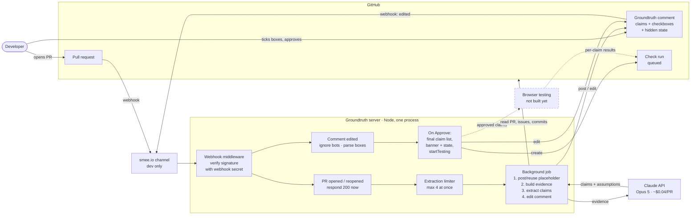
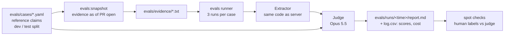

# Architecture (as built)

Calls to GitHub's API use an installation token: the app signs a token with its **private key**, and GitHub exchanges it for a short-lived token scoped to the installation. Incoming webhooks are checked against the **webhook secret**.

**Where state lives:** the PR comment is the only record for a live PR (claims, the developer's edits, approval). There's no database yet, and server logs are console output only.

## Offline: evals

