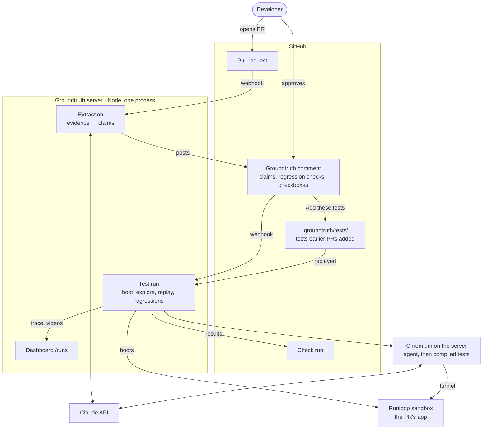
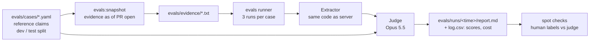

# Architecture (as built)

Calls to GitHub's API use an installation token: the app signs a token with its **private key**, and GitHub exchanges it for a short-lived token scoped to the installation. Incoming webhooks are checked against the **webhook secret**. In development they reach the laptop through a smee.io channel.

**A test run:** the server boots the PR's head commit in a Runloop sandbox and reaches the app through an authenticated tunnel. The browser runs on the server, not in the sandbox. The agent (Claude, with tools to read the page, act, and run assertions from a fixed menu) checks each approved claim and gives it a status: verified, failed, blocked, unreachable or error. The run is compiled into Playwright tests and replayed once on the same app. Then the regression tests earlier PRs committed under `.groundtruth/tests/` are read from the base branch's tip, so the PR can't edit them, and replayed. The sandbox shuts down after the run.

**Where state lives:** the PR comment holds the claims, the developer's edits and the approval. The `runs/` folder holds each run's trace and videos, read by the dashboard. Accepted tests live in the repo under `.groundtruth/`. There's no database, jobs are in memory, and server logs are console output only.

## Offline: evals

